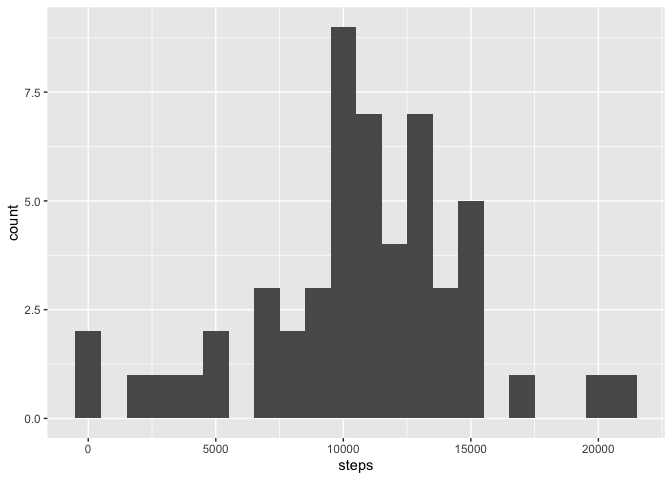
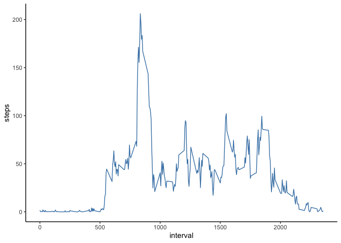
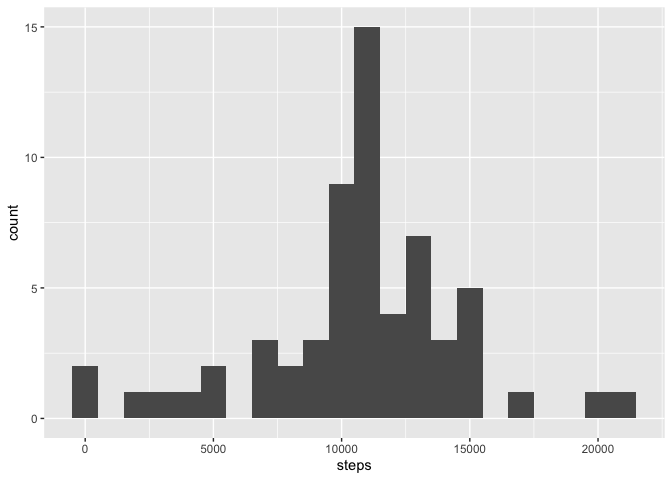
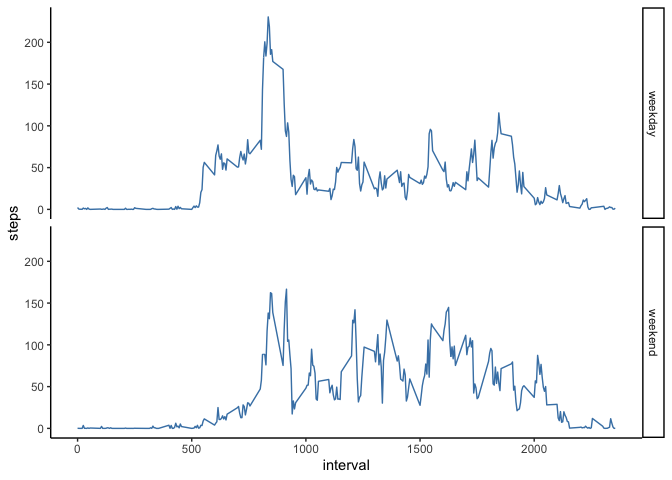

## Loading and preprocessing the data

```r
library(ggplot2)
library(dplyr)
```

```
## 
## Attaching package: 'dplyr'
```

```
## The following objects are masked from 'package:stats':
## 
##     filter, lag
```

```
## The following objects are masked from 'package:base':
## 
##     intersect, setdiff, setequal, union
```

```r
if(!file.exists("activity.csv")){
        unzip("activity.zip")        
}
data <- read.csv('activity.csv', sep = ",",header = TRUE, na.strings ="NA",colClasses = c('integer','Date','integer'))
#data$date <- as.Date(data$date, format = "%Y-%m-%d")
```

## What is mean total number of steps taken per day?

```r
dailyStepsTotal <- aggregate(steps ~ date, data, sum)
g <- ggplot(data = dailyStepsTotal, aes(steps)) + geom_histogram(binwidth = 1000)
print(g)
```

<!-- -->

  
The mean number of steps taken per day is:


```r
mean(dailyStepsTotal$steps)
```

```
## [1] 10766.19
```
The median number of steps taken per day is:


```r
median(dailyStepsTotal$steps)
```

```
## [1] 10765
```


## What is the average daily activity pattern?


```r
averageStepsTimeInterval <- aggregate(steps ~ interval,data,mean,na.rm = TRUE)
h<-ggplot(averageStepsTimeInterval,aes(interval,steps))+
        geom_line(colour = "steelblue") +
        theme_classic()
print(h)
```

<!-- -->

The interval with the maximum average number of steps is:


```r
averageStepsTimeInterval[which.max(averageStepsTimeInterval$steps),]$interval
```

```
## [1] 835
```
  
## Imputing missing values

The total number of missing values in the dataset is:


```r
sum(is.na(data$steps))
```

```
## [1] 2304
```
  
Apply the average number of steps for the missing interval for missing values:


```r
data_imputed <- data
nrow(data_imputed)
```

```
## [1] 17568
```

```r
for(i in 1:nrow(data_imputed)){
        if(is.na(data_imputed[i,]$steps)){
               data_imputed[i,]$steps <- averageStepsTimeInterval[averageStepsTimeInterval$interval == data_imputed[i,]$interval,]$steps           
        }
}
```

```r
dailyStepsTotal_imputed <- aggregate(steps ~ date, data_imputed, sum, na.rm = TRUE)
g <- ggplot(data = dailyStepsTotal_imputed, aes(steps)) + geom_histogram(binwidth = 1000)
print(g)
```

<!-- -->

The mean number of steps taken per day once the interval average has been applied is:


```r
mean(dailyStepsTotal_imputed$steps)
```

```
## [1] 10766.19
```
The median number of steps taken per day once the interval average has been applied is:


```r
median(dailyStepsTotal_imputed$steps)
```

```
## [1] 10766.19
```

The difference between the mean before and after dealing with NAs is:


```r
mean(dailyStepsTotal$steps)-mean(dailyStepsTotal_imputed$steps)
```

```
## [1] 0
```
  
The difference between the median before and after dealing with NAs is:


```r
median(dailyStepsTotal$steps)-median(dailyStepsTotal_imputed$steps)
```

```
## [1] -1.188679
```

After the interval average has been applied to the NAs, the median moves to the mean. 

## Are there differences in activity patterns between weekdays and weekends?

Create a new factor variable in the dataset with two levels - "weekday" and "weekend":


```r
data_imputed <- data_imputed %>% mutate(data_imputed$date, weektype = factor(if_else(weekdays(date) == "Saturday"|weekdays(date) == "Sunday","weekend","weekday")))
```

Panel Plot


```r
averageStepsTimeInterval_Imputed <- aggregate(steps ~ interval + weektype, data_imputed,mean)
i <- ggplot(averageStepsTimeInterval_Imputed, aes(interval, steps))+
        geom_line(colour = "steelblue")+
        facet_grid(weektype~.)+
        theme_classic()
print(i)
```

<!-- -->

